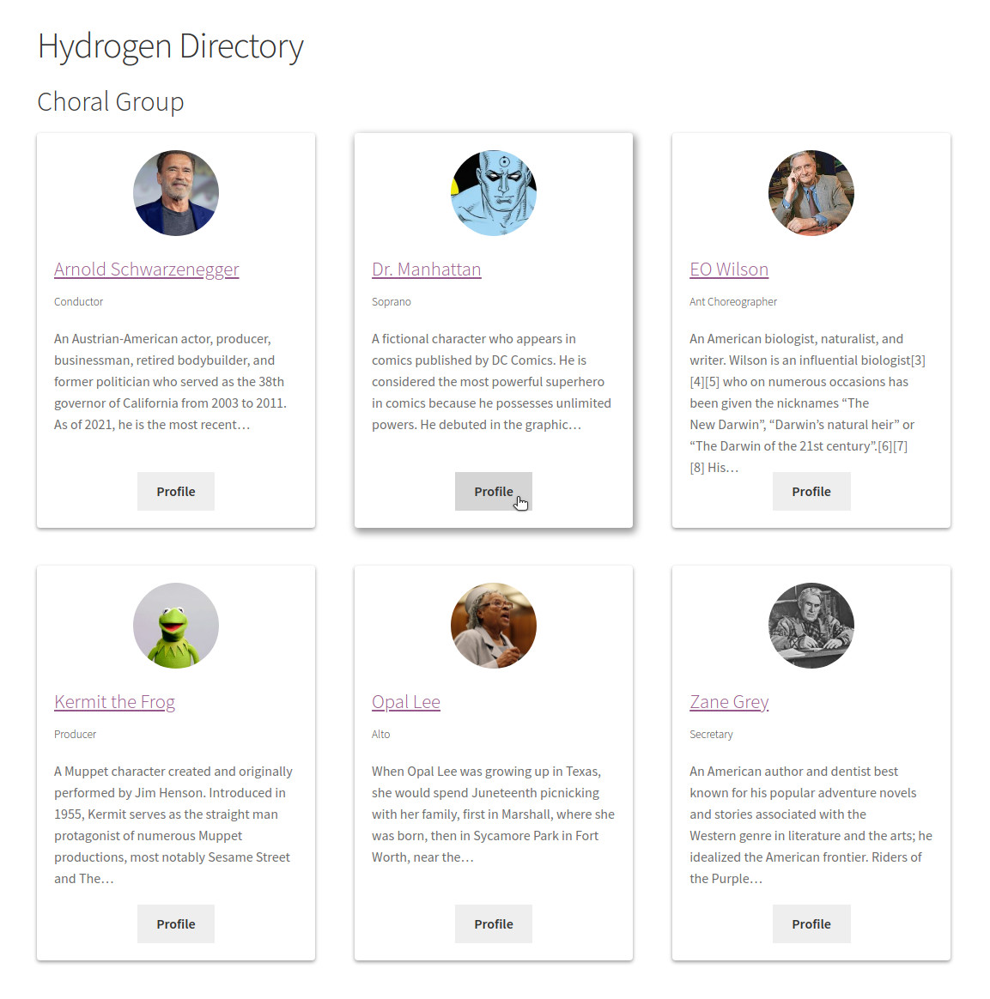

# Hydrogen Directory

**Contributors:** LBell \
**Donate link:** https://github.com/sponsors/lbell \
**Tags:** directory, student, employee, people list, board members, church, club, officers \
**Requires at least:** 3.0 \
**Tested up to:** 5.7 \
**Stable tag:** 1.0.0 \
**License:** GPLv2 or later \
**License URI:** http://www.gnu.org/licenses/gpl-2.0.html

The simplest, lightest way to manage and display a directory of anything.

## Description

Finally!

A ridiculously light, stupidly-simple plugin to manage and display a directory of anything: production cast, blog contributors, businesses, collectors items, church members, books, club officers, chickens in your flock, departmental employees, students, bowling league teams... you get the point.

Most "directory" plugins out there are way too complicated. One of the more popular ones weighs in at 30 MB! That's almost as much code as Wordpress Core. That's uranium heavy. Be careful of meltdowns...

_Enter Hydrogen Directory._

This plugin is light and simple, just like hydrogen. Weighing just 33kb zipped, it's so tiny it might float away.

Whether you need to just list the 3 members on your team, are looking to showcase the 200 cars in your pinewood derby league, or need to import 10,000 employees, Hydrogen Directory manages it all with ease, speed, and predictable grace.

Highlights:

1. Quickly add or updated listings in wordpress using familiar interface.
1. Organize entries into buckets using taxonomies.
1. Display your directories anywhere on your site using shortcodes.

That's it! Get on to more important things in your life.

## Installation

1. Upload the `hydrogen-directory` folder to the `/wp-content/plugins/` directory.
1. Activate `Hydrogen Directory` through the 'Plugins' menu in WordPress dashboard.
1. Use the shortcode `[hydrogen-directory]` directly in your page or post content.

## Shortcode Arguments

| Attribute | Description                       | Default | Notes                                                          |
| --------- | --------------------------------- | ------- | -------------------------------------------------------------- |
| tax       | Taxonomy to display               | role    | Base plugin includes "role" tax                                |
| term      | Term of above taxonomy (optional) |         | Limits tax to specified term. Use term name or slug.           |
| style     | Style of listing                  | list    | Base plugin includes: 'text', 'list', and 'card' styles        |
| columns   | Number of columns                 | 1       |                                                                |
| headers   | Include headers                   | 1       | 1 = yes, 0 = no to include the Taxonomy and Terms in your list |

Example: `[hydrogen_directory tax="role" term="Alter Boy" style="list" columns=3]`

## Screenshots

1. Included "list" style.

   
&nbsp;
&nbsp;

2. Included "card" style.

   
&nbsp;
&nbsp;

3. Included "text" style.

   
&nbsp;
&nbsp;

4. Custom avatar style.

   
&nbsp;
&nbsp;

5. Settings page (There isn't one. It's that simple.)

   
&nbsp;
&nbsp;

## Frequently Asked Questions

### Can I import entries from a CSV?

Yes - you can import using standard CSV import pathways. Although WordPress does not offer CSV import function natively, there are a number of plugins that will add this feature. This plugin has been tested successfully with the "Really Simple CSV Importer" plugin. (Note, entries in the file must be **comma** separated.)

### How do I theme the output?

You have several options:

1. Add custom css to your theme to tweak the look.
1. Override the default templates by copying any of the `directory-list-entry-{type}.php` files into your theme, and modifying it there.
1. Use the plugin hooks (filters / actions) to customize specific parts.

### Can this plugin do X,Y or Z?

Probably not. But it could!

Hydrogen Directory is purposefully simple and easy. But it can extended in powerful ways. Contact me for requests for additional functionality.

---

## Changelog

### 1.0.0

Initial Release
